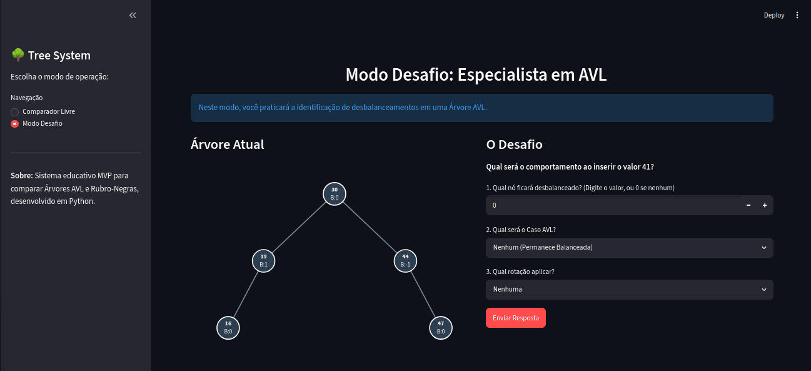
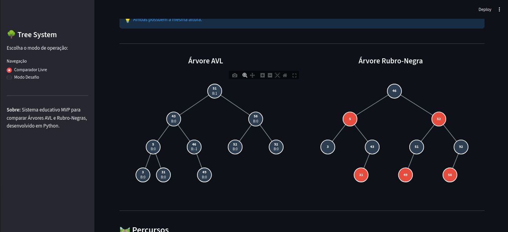
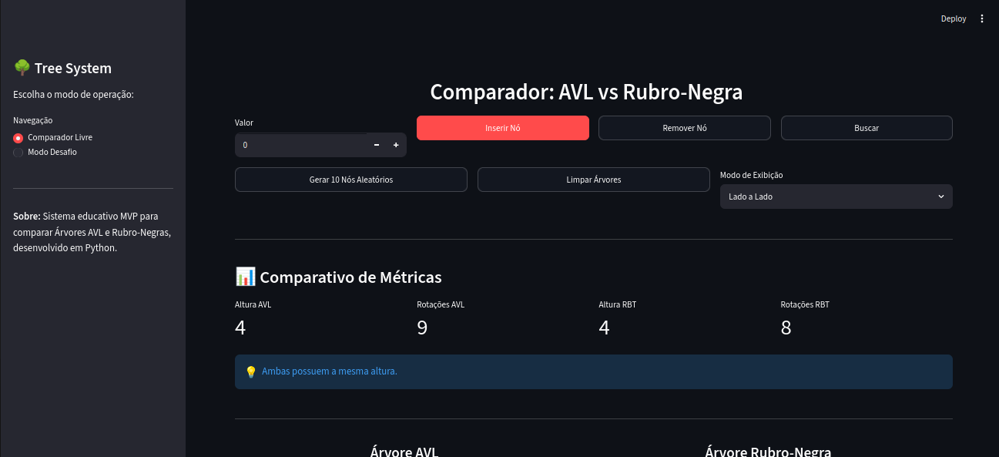
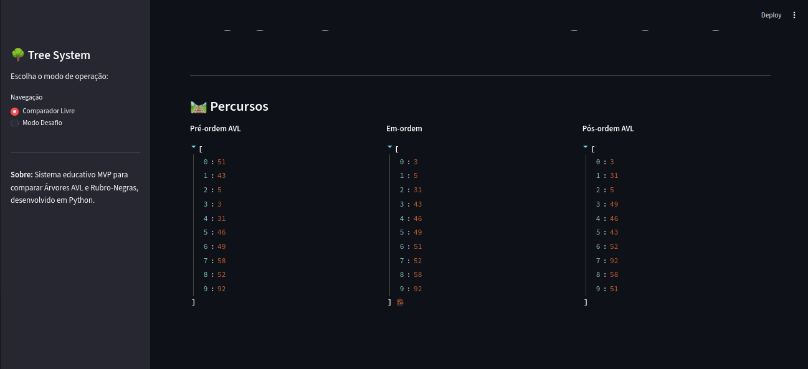

# G11-Arvores-2026-01

**Número da Lista**: ?<br>
**Conteúdo da Disciplina**: Árvores Balanceadas (AVL e Rubro-Negra)<br>

## Alunos
|Matrícula | Aluno |
| -- | -- |
| 22/1007706  |  Elias Faria de Oliveira |
| ? | ? |

Projeto acadêmico para fins didáticos que visa a construção de um **Sistema Comparador de Árvores AVL e Rubro-Negra**, somado a um ambiente gamificado de **Modo Desafio**.

---

## Visão geral

O objetivo do projeto é demonstrar, de maneira visual e interativa, o comportamento de rebalanceamento entre as duas principais estruturas de árvores balanceadas na computação.

Neste projeto você encontrará:

- **Modo Comparador Livre**: Permite ao usuário inserir valores, remover e buscar nós. A aplicação exibe ambas as árvores (lado a lado ou individualmente) desenhadas dinamicamente, além de exibir as métricas de Altura e Quantidade de Rotações acumuladas.
- **Modo Desafio**: Um quiz interativo ("Especialista em AVL"). O sistema gera um estado da árvore, propõe a inserção de um valor surpresa, e exige que o aluno identifique corretamente qual nó ficará desbalanceado, qual o Caso (LL, RR, LR, RL) e qual Rotação deve ser aplicada.

O frontend foi construído em Streamlit e a renderização dos grafos dinâmicos utiliza a biblioteca Plotly para permitir redimensionamento e visualização fluída.

---

## Estrutura do projeto

```text
Tree-comparison/
├── app.py
├── architecture_plan.md
├── requirements.txt
├── README.md
├── core/
│   ├── node.py           # Definição dos nós (AVLNode, RBNode)
│   ├── avl_tree.py       # Algoritmo de balanceamento rígido (Fator de Balanço)
│   └── rb_tree.py        # Algoritmo de balanceamento flexível (Regras de Cores)
├── views/
│   ├── comparator.py     # Interface do modo livre
│   └── challenge.py      # Interface do motor de gamificação
└── visualizer/
    └── renderer.py       # Algoritmos de layout matemático (X,Y) e plotagem
```

### Arquivos principais

- `app.py`: Interface central da aplicação.
- `core/avl_tree.py`: Árvore que mantém a altura sempre com diferença máxima de 1, realizando rotações imediatas.
- `core/rb_tree.py`: Árvore que utiliza o sistema de cores (Vermelho e Preto) e TNULL para manter o balanceamento com menos rotações físicas.

---

## Como o projeto funciona

### 1. Inserção e Deleção Customizada
Sempre que o usuário dispara uma ação na interface, o sistema injeta as chaves em instâncias rodando em memória de `AVLTree` e `RedBlackTree`.

### 2. Renderização Plotly
Para o desenho das árvores na tela, o módulo visualizador percorre a árvore gerada e calcula níveis de hierarquia (`dx`, `dy`) para assinalar as posições X e Y de cada nó numa grade invisível. Após o cálculo, a árvore é plotada graficamente com linhas conectando os nós, permitindo ao usuário até dar zoom e focar em pedaços das árvores.

### 3. Motor de Desafio
O Modo Desafio intercepta a requisição antes de mostrar a resposta, injeta em uma cópia da `AVLTree` no Backend, avalia o que os logs de rotação relataram (ex: Rotação Dupla à Direita no nó 15) e compara com o gabarito preenchido pelo aluno.

---

## Aplicação


### Modo Desafio


### Modo Comparador Livre




# Percursos em Árvores



## Link da Gravação

[Gravação](https://www.youtube.com/playlist?list=PLy6hlCyBC58qMHN8_tbyLqvu0yux2FBq5)

---

## Explicação: Árvore AVL vs Rubro-Negra

- **Árvore AVL:** O "Perfeccionista". Exige que a diferença de altura entre os lados esquerdo e direito de cada nó seja no máximo 1. Se quebrar essa regra, faz rotação. O resultado é a árvore mais compacta possível para buscas, mas com inserções custosas (muitas rotações).
- **Árvore Rubro-Negra:** O "Malandro". Usa um esquema de propriedades matemáticas de cores para relaxar a exigência de altura (o caminho mais longo nunca é maior que 2x o caminho mais curto). Ao invés de sempre rotacionar, ela tenta apenas "repintar" nós para restaurar a ordem, o que a torna mais leve durante inserções.

Ambas suportam buscas de ordem `O(log N)`.

---

## Tecnologias utilizadas

- **Python 3** (Back-end e classes nativas orientadas a objetos)
- **Streamlit** (Front-end e gerência de estado de sessão)
- **Plotly** (Mapeamento de grafos e renderização visual)

---

## Como rodar o projeto

### 1. Criar e ativar o ambiente virtual (Opcional, porém recomendado)

```bash
python3 -m venv .venv
source .venv/bin/activate
```

### 2. Instalar as dependências

É necessário instalar o Streamlit e o Plotly.

```bash
pip install -r requirements.txt
```

### 3. Executar a aplicação

```bash
streamlit run app.py
```

O projeto será aberto no navegador no endereço `http://localhost:8501`.

---

## Autores

Projeto desenvolvido para fins acadêmicos na disciplina de Estrutura de Dados e Algoritmos 2 da Universidade de Brasília (UnB).
